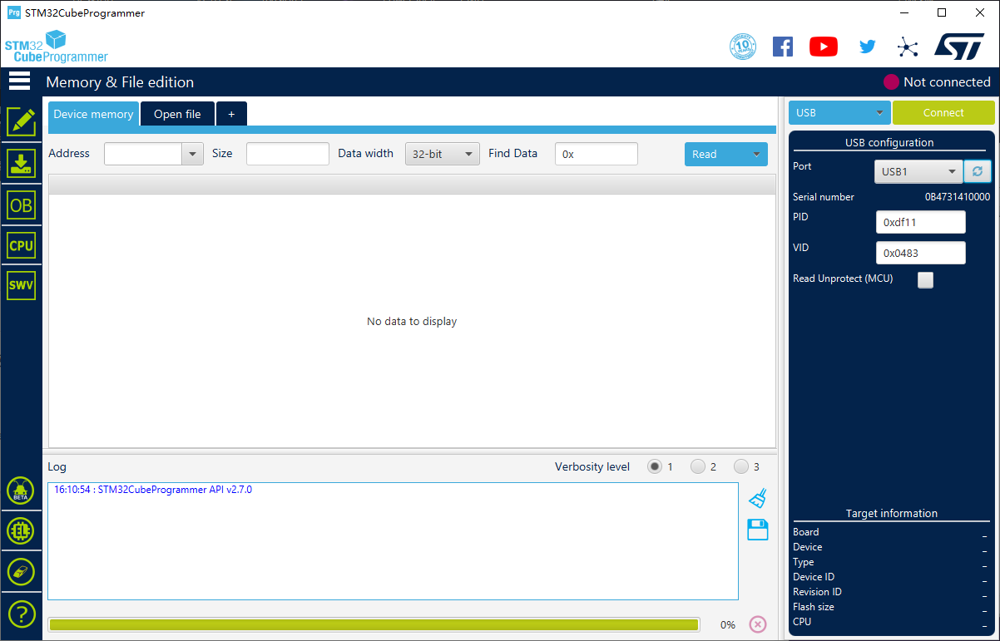
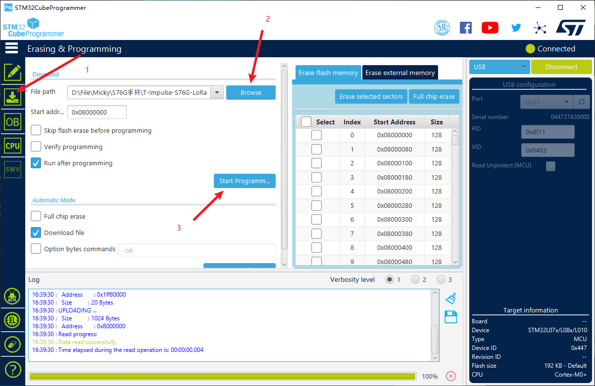

##  Firmware upload guide
1. When uploading firmware, you need to make the device enter DFU mode. The steps to enter DFU mode are: 
>`Method 1`: When it is not powered on, press and hold the BOOT button to connect to the USB. 

> `Method 2`: In the power-on state, first press and hold the BOOT button, then press the RES button, release the RES button, and release the BOOT button. 

    Observe whether there is `STM Device in DFU Mode` or `STM32 BOOTLOADER` serial device in the device manager, if one of them exists, it proves that it has successfully entered DFU mode.

2. If `STM Device in DFU Mode` is displayed in the device manager, you need to use the Zadig software to reinstall the driver to make it `STM32 BOOTLOADER`.
- Open *ZADIG->options->list all devices*.
Select `STM Device in DFU Mode` and convert to `WinUSB` format.

3. Open the [**Stm32CubeProgrammer**](https://www.st.com/en/development-tools/stm32cubeprog.html) software, select the USB device, refresh the selection and connect the device.

- After the connection is successful, select the firmware name and click step by step to start uploading
